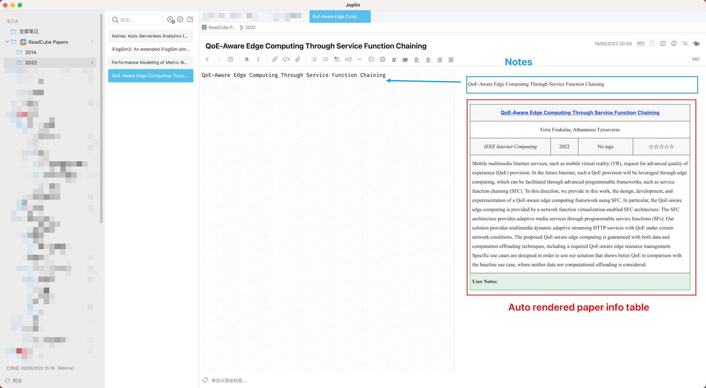
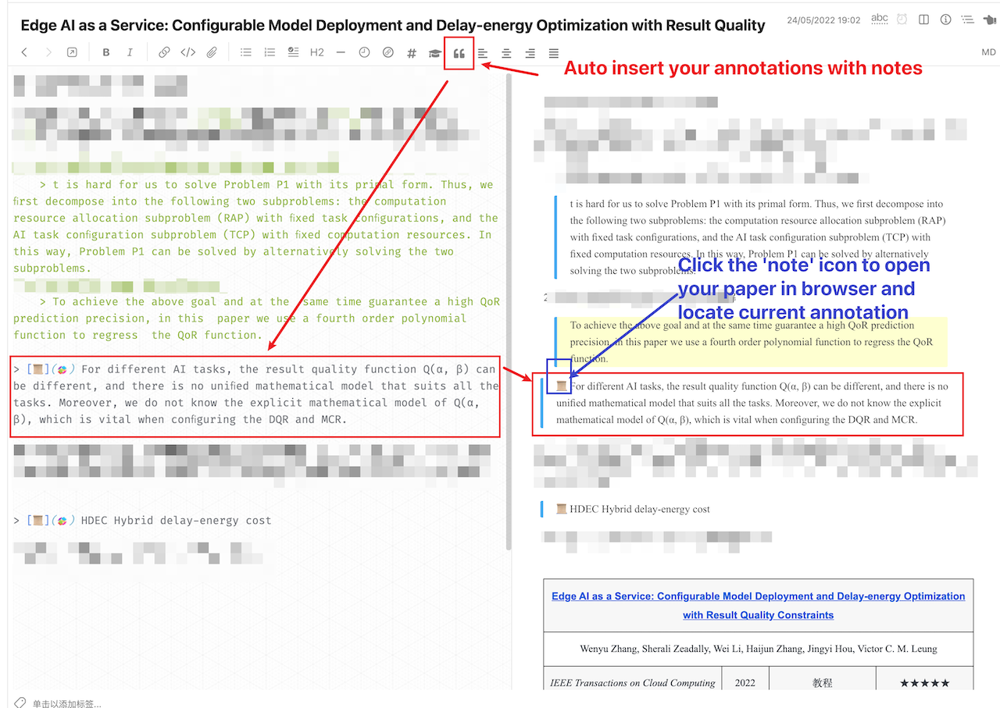
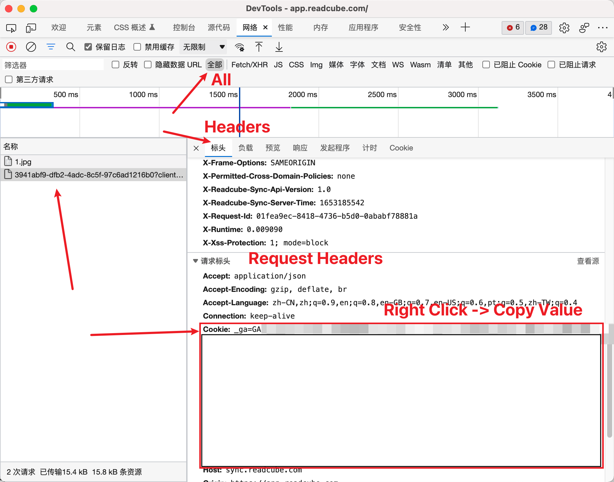

## ReadCube Papers

> 使用到的 API 接口说明见：[ReadCube Papers API](https://blog.hxgpark.com/posts/ReadCubePapersAPI/)

ReadCube Papers is a reference manager: [Official website](https://www.papersapp.com/).

This plugin supports:

1. Sync your papers information to local database. [Almost real time syncing due to the websocket protocal].
2. Render a paper info table after the note content for paper note. [Note created by the menu 'Tools -> Create notes for papers'].
3. Direct link to the PDF file in the paper info table.
4. Auto insert formatted references through tool button.
5. Auto insert annotations through tool button with quick-jump-to-annotation-in-browser function.

> **WARNING**: DO NOT delete the `source_url` attribute of notes. It helps to tell the renderer which notes should be rendered with a paper information table. The notes created for Papers have the `source_url` with the `papers_` prefix.

> Dialog UI code from [joplin/plugin-bibtex.git](https://github.com/joplin/plugin-bibtex.git)

How to use:
1. In the Joplin Settings -> Joplin Enhancement -> Set your cookie for Papers
2. ~~Joplin Menubar -> Tools -> Sync files with Papers: It will create notes for your papers without the annotations~~
    1. Not needed anymore. Now it will fetch the papers and keep syncing based on websocket
3. 'Tools -> Create notes for papers'. **Only the notes created in this way can have a rendered paper information table**

How to get cookies:
1. Open your browser, go to your Papers Library
2. Press F12 to open developer tools.
3. Click any paper
4. 

## Roadmap

### Coming soon

- [x] Colorful syntax support for quota in markdown [You need to install the [Enhancement](https://github.com/SeptemberHX/joplin-plugin-enhancement) plugin and enable the 'Colorful Blockquote' feature]
  - [x] Allows `> [color=red] xxxx` so that the quota is rendered in different color (syntax from hackmd)
  - [x] Allows `> [name=SeptemberHX] xxx` so that the quota is rendered with a username to distinguish annotations from different users (syntax from hackmd)
  - [x] Render the annotations with the same colors in the Papers application
- [ ] Insert paper figures directly into the note as attached resource files
  - papers published by specific publishers can be attached with all the figures as separate image files in ReadCuge Papers. We can allow users to download the figures and insert to the notes
  - However, only papers from some publishers can be provided with separate figure files. This feature cannot work for all papers.
- [ ] Attach the text file that contains all the text in the paper pdf as attached resources in paper notes
  - It allows users to search both the notes and the papers

### Won't do

1. anything related to annotating the papers in Joplin
   1. for example: marginnote Like
   2. please make full use of each professional tools to do the right thing
2. save pdf as attached resource files
   1. Joplin is pretty weak about the attachment management
   2. The size of the Joplin notebook will grow significantly with too many pdf files, which is painful for syncing between multiple devices (however, the text file is really small)
3. anything related to the ReadCube Papers' dimension feature

## Building the plugin

The plugin is built using Webpack, which creates the compiled code in `/dist`. A JPL archive will also be created at the root, which can use to distribute the plugin.

To build the plugin, simply run `npm run dist`.

The project is setup to use TypeScript, although you can change the configuration to use plain JavaScript.

## Updating the plugin framework

To update the plugin framework, run `npm run update`.

In general this command tries to do the right thing - in particular it's going to merge the changes in package.json and .gitignore instead of overwriting. It will also leave "/src" as well as README.md untouched.

The file that may cause problem is "webpack.config.js" because it's going to be overwritten. For that reason, if you want to change it, consider creating a separate JavaScript file and include it in webpack.config.js. That way, when you update, you only have to restore the line that include your file.
